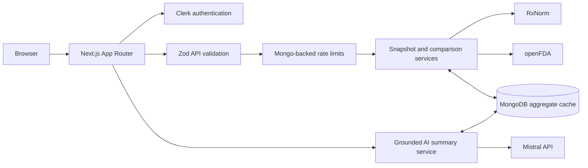

# Drug Safety Signal Explorer

A production-oriented pharmacovigilance explorer that turns public FDA Adverse Event Reporting System (FAERS) aggregates into readable drug dashboards, side-by-side comparisons, saved reports, and tightly grounded AI summaries.

> **Research context only.** FAERS reports do not prove causality, measure incidence, or establish that one medicine is safer than another. This application is not medical advice.

## Why this project exists

Public safety-reporting data is valuable but difficult to interpret responsibly. This project demonstrates how to build a privacy-conscious analytical product around that data while keeping the limitations visible at every decision point. It combines resilient upstream clients, canonical drug normalization, durable aggregate caches, authenticated user workflows, server-side abuse controls, and constrained AI output in one deployable Next.js application.

## Features

- Search by brand or generic drug name with RxNorm canonicalization.
- Aggregate FAERS dashboards with report volume, seriousness breakdown, top reactions, yearly trends, and label context.
- Two-drug comparison workspace with overlapping and distinct reported reactions.
- Cached, schema-constrained Mistral summaries grounded only in displayed aggregate snapshots.
- Clerk email/password authentication, account security, and per-user saved reports.
- Allowlisted admin control room for inspecting, refreshing, and deleting cached snapshots and reviewing operational logs.
- MongoDB-backed caching, single-flight generation, distributed AI leases, TTL cleanup, and cross-cache invalidation.
- Zod validation at public API boundaries and shared server-side rate limiting for expensive searches, comparisons, and AI generation.
- Global loading, not-found, route-error, and root-error experiences with sensitive details withheld.
- Render Blueprint, environment validation, health checks, security headers, and production runbook.

## Stack

| Layer | Technology |
| --- | --- |
| Application | Next.js 16 App Router, React 19, TypeScript |
| UI | Tailwind CSS 4, Lucide, Recharts |
| Authentication | Clerk |
| Persistence | MongoDB Atlas, official MongoDB Node driver |
| Validation | Zod |
| Drug identity | NIH RxNorm APIs |
| Safety and label data | openFDA FAERS Drug Event and Drug Label APIs |
| AI context | Mistral chat completions, server-side only |
| Hosting | Render Node web service |

## Architecture



All third-party credentials and data-fetching clients live in server-only modules. The browser receives aggregate snapshot payloads, never upstream API keys. MongoDB stores aggregates, identities, saved report copies, operational logs with TTL retention (30 days for openFDA requests and 90 days for searches), short-lived rate-limit counters, and AI cache/lease records; the application does not ingest or persist raw patient-level FAERS case records.

## Data sources

- [openFDA Drug Adverse Event API](https://open.fda.gov/apis/drug/event/) — aggregate counts derived from public FAERS reports.
- [openFDA Drug Label API](https://open.fda.gov/apis/drug/label/) — selected public prescribing-label context.
- [NIH RxNorm APIs](https://lhncbc.nlm.nih.gov/RxNav/APIs/RxNormAPIs.html) — normalized names and RxCUIs.
- [Mistral API](https://docs.mistral.ai/api/) — constrained summaries generated from already-computed aggregate snapshots.

## FAERS limitations

- A report is an observation submitted to FAERS, not proof that a drug caused an event.
- Counts are not adjusted for prescriptions, exposure duration, market share, duplicate reports, reporting quality, or notoriety bias.
- Reporting practices and product usage change over time, so raw yearly counts are not incidence rates.
- Seriousness is a regulatory report classification, not a personalized prediction.
- Comparing counts between drugs does not establish comparative safety.
- Missing label data or a missing aggregate does not establish absence of risk.
- AI text is restricted to the cached snapshot but can still be incomplete; verify important conclusions against authoritative clinical and regulatory sources.

## Local setup

### Prerequisites

- Node.js `24.14.x` (the repository pins `24.14.1` for Render)
- Corepack and pnpm `11.5.2`
- MongoDB Atlas database
- Clerk application
- Mistral API key
- Optional openFDA API key

### Configure and run

```bash
corepack enable
corepack pnpm install --frozen-lockfile
```

Copy `.env.example` to `.env.local` and provide:

| Variable | Required | Visibility | Purpose |
| --- | --- | --- | --- |
| `MONGODB_URI` | Yes | Server only | Atlas connection string |
| `MONGODB_DB` | Yes | Server only | Database name |
| `NEXT_PUBLIC_CLERK_PUBLISHABLE_KEY` | Yes | Browser-safe | Clerk frontend initialization |
| `CLERK_SECRET_KEY` | Yes | Server only | Clerk server authentication |
| `ADMIN_EMAILS` | Yes | Server only | Comma-separated verified admin emails |
| `MISTRAL_API_KEY` | Yes | Server only | Cached AI summary generation |
| `OPENFDA_API_KEY` | No | Server only | Higher openFDA request allowance |

Validate configuration, create indexes, and start development:

```bash
corepack pnpm env:validate
corepack pnpm db:create-indexes
corepack pnpm dev
```

Open [http://localhost:3000](http://localhost:3000). Never place MongoDB, Clerk secret, openFDA, or Mistral credentials in a `NEXT_PUBLIC_*` variable or commit a populated environment file.

## Quality checks

```bash
corepack pnpm lint
corepack pnpm test:openfda
corepack pnpm test:openfda:client
corepack pnpm test:rxnorm
corepack pnpm test:rxnorm:client
corepack pnpm test:drug-snapshot
corepack pnpm test:saved-reports
corepack pnpm test:comparison
corepack pnpm test:ai-summary
corepack pnpm test:admin
corepack pnpm test:production
corepack pnpm build
corepack pnpm test:client-secrets
```

## Render deployment

The included `render.yaml` provisions a Node web service in Frankfurt, pins Node `24.14.1`, validates environment variables, builds the application, scans client assets for server credentials, starts the Next.js server, and checks `/api/health`. The application needs a web service—not a static site—because it performs authenticated server rendering, database operations, upstream requests, and server-only AI generation.

1. Push the repository and select **New → Blueprint** in Render.
2. Connect the repository; Render discovers the root `render.yaml`.
3. Supply every `sync: false` value when prompted. Secret values are intentionally absent from the Blueprint.
4. In MongoDB Atlas, allow the service’s [Render outbound IP ranges](https://render.com/docs/outbound-ip-addresses) and create a least-privilege database user. Avoid `0.0.0.0/0` for a real deployment.
5. In Clerk, add the final `https://<service>.onrender.com` origin and the application’s login, registration, account, and callback URLs.
6. Deploy. The build runs install → environment validation → Next.js build; the service becomes healthy only after configuration validation and a MongoDB ping succeed.
7. Run `corepack pnpm db:create-indexes` once as a Render Shell command (and after index definitions change). Verify `/api/health`, authentication, a cached search, a cold search, comparison, AI summary, saved report, and admin access.
8. Configure a custom domain if desired, then add that domain to Clerk before switching traffic.

Render exposes the real client IP as the first `X-Forwarded-For` entry. This application trusts that header only when Render identifies the runtime, hashes the address before storage, and uses it only for rate limiting.

## Screenshot placeholders

| View | Placeholder |
| --- | --- |
| Landing and drug search | Add `docs/screenshots/home.png` |
| Drug aggregate dashboard | Add `docs/screenshots/drug-dashboard.png` |
| Comparison workspace | Add `docs/screenshots/comparison.png` |
| Saved reports and admin | Add `docs/screenshots/operations.png` |

## Future improvements

- Add end-to-end browser tests against disposable Clerk and MongoDB environments.
- Add observability dashboards and alerting around upstream latency, cache misses, and rate-limit pressure.
- Add accessible downloadable reports with explicit provenance and snapshot timestamps.
- Expand terminology support while preserving canonical identity and cache invariants.
- Add deployment previews backed by isolated non-production credentials and data.
- Complete a formal threat model and dependency/SBOM reporting for sustained public operation.

## License and responsible use

No license has been selected yet. Review the upstream data-source terms and add an explicit project license before redistribution. Do not use this application to make individual treatment decisions.
